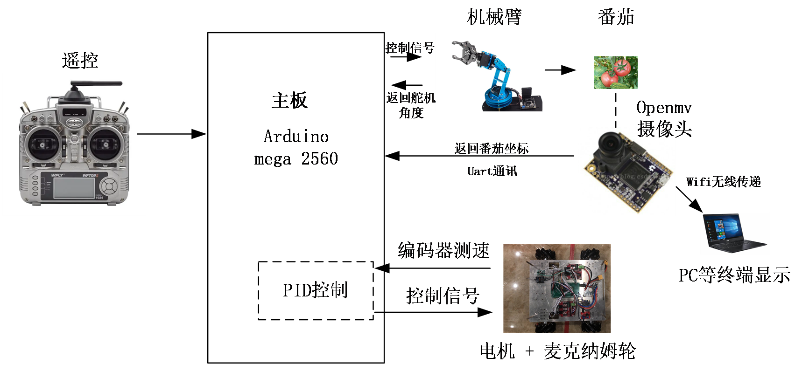
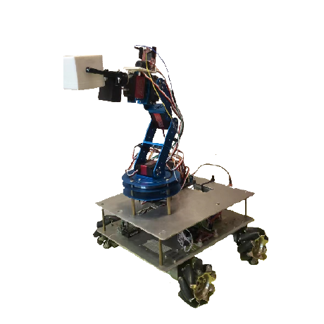

# RoboPicker

## 项目简介

RoboPicker是一个由王子谦于2022年在华师大二附中科创班就读期间开发的机器人项目，该项目获得了上海市第37届科创大赛一等奖。RoboPicker由三个主要部分组成：底盘、机械臂和openmv相机。

## 研究内容 & 成果

## 仓库内容

- **代码**：在`./code`中，包含了RoboPicker的所有代码，代码分为底盘、机械臂和相机三个部分。
- **CAD文件**：在`./CADs`中，包含了RoboPicker的所有CAD设计文件。
- **arduino拓展板设计图**：`./PCB/mega_shield.pcbdoc`文件是RoboPicker的电路图。

## 结构图

## 机器人成品展示

## 致谢

感谢所有为本项目提供支持和帮助的人们，特别感谢第37届科创大赛评审团对本项目的认可。